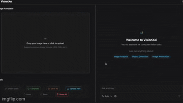

# AnnotAIx

AnnotAIx is an advanced AI-powered image analysis platform that combines Google's Gemini models with intelligent web search capabilities to provide comprehensive visual content understanding and interactive Q&A functionality.

## Project Overview

AnnotAIx integrates cutting-edge machine learning models with a modern web application architecture, featuring a responsive Angular frontend, a robust FastAPI backend, and an advanced LangGraph-based LLM processing pipeline. The system enables users to upload images and receive detailed AI-generated analysis, enhanced with real-time web search when additional context is needed.

## Project Structure

### LLM/

Contains the core AI/ML logic with LangGraph workflow orchestration:

- Advanced image analysis using Google Gemini 2.5 Flash
- Intelligent web search integration with Tavily API
- Stateful conversation management with memory persistence
- Bounding box detection and visual analysis
- Modular graph-based workflow architecture

### Frontend/

Modern Angular application with server-side rendering:

- Responsive design with Tailwind CSS
- Real-time streaming response support
- Dynamic state management
- Nx monorepo tooling for build optimization
- Jest testing framework

### Backend/

FastAPI-based REST API service:

- Image processing and base64 encoding
- LangGraph workflow execution
- CORS-enabled cross-origin support
- Asynchronous streaming endpoints
- Integration with LLM analysis pipeline

## Getting Started

### Prerequisites

- Python 3.8 or higher
- Node.js 18 or higher and npm
- Google API Key for Gemini models
- Tavily API Key for web search functionality

### Installation

1. Clone the repository:

   ```bash
   git clone https://github.com/manu042k/AnnotAIx.git
   cd AnnotAIx
   ```

2. Set up environment variables:

   Create a `.env` file in both `Backend` and `LLM` directories:

   ```env
   GOOGLE_API_KEY=your_google_api_key_here
   TAVILY_API_KEY=your_tavily_api_key_here
   ```

3. Install Backend dependencies:

   ```bash
   cd Backend
   python -m venv env
   source env/bin/activate  # On Windows: env\Scripts\activate
   pip install -r requirements.txt
   ```

4. Install Frontend dependencies:

   ```bash
   cd Frontend
   npm install
   ```

### Running the Application

#### Backend Server

Navigate to the `Backend` directory and start the FastAPI server:

```bash
cd Backend
source env/bin/activate  # On Windows: env\Scripts\activate
uvicorn app.main:app --reload
```

The backend API will be available at `http://localhost:8000`

#### Frontend Application

Navigate to the `Frontend` directory and start the development server:

```bash
cd Frontend
npx nx serve Frontend
```

The frontend application will be available at `http://localhost:4200`

### Testing

#### Frontend Tests

Run tests using Jest:

```bash
cd Frontend
npx nx test Frontend
```

#### LLM Module Tests

Run example scripts to test the image analysis pipeline:

```bash
cd LLM/examples
python run_analyzer.py
```

## Core Features

### Advanced Image Analysis

The ImageAnalyzer class provides sophisticated visual understanding capabilities:

- **Multi-turn Conversation Memory**: Maintains context across multiple queries about the same image
- **Bounding Box Detection**: Identifies and analyzes specific regions within images
- **Intelligent Search Integration**: Automatically determines when web search is needed for accurate responses
- **Comprehensive Summarization**: Generates detailed descriptions with proper citations
- **Streaming Support**: Real-time response generation for enhanced user experience

### Workflow Architecture

The system uses LangGraph to orchestrate a stateful workflow:

1. **Memory Loading & Image Encoding**: Retrieves conversation history and processes base64 image data
2. **Initial Query Analysis**: Examines the user's question to understand intent
3. **Bounding Box Detection**: Identifies objects and regions of interest
4. **Search Decision**: Determines if external context is required
5. **Web Search**: Fetches relevant information using Tavily API (when needed)
6. **Final Analysis**: Generates comprehensive response incorporating all available context
7. **Memory Persistence**: Stores conversation for future interactions

### API Endpoints

- `GET /`: Health check endpoint
- `POST /chat/`: Synchronous image analysis endpoint
- `POST /chat/stream/`: Streaming image analysis endpoint

## Technology Stack

### Backend

- FastAPI for REST API framework
- LangChain and LangGraph for LLM orchestration
- Google Generative AI (Gemini 2.5 Flash)
- Tavily Python SDK for web search
- Uvicorn ASGI server

### Frontend

- Angular 17+ with TypeScript
- Tailwind CSS for styling
- Nx for monorepo management
- Jest for unit testing
- Server-side rendering support

### AI/ML

- Google Gemini 2.5 Flash for vision and language
- LangGraph for stateful workflow management
- Memory persistence with MemorySaver

## Development Workflow

### Backend Development

The backend uses a modular architecture with clear separation of concerns:

- `app/main.py`: FastAPI application and route definitions
- `app/models.py`: Pydantic models for request/response validation
- `app/config.py`: Environment configuration loading
- `app/graphs/image_analyzer.py`: Core LangGraph workflow implementation
- `app/core/states.py`: TypedDict state definitions
- `app/tools/web_search.py`: Tavily search integration

### Frontend Development

The frontend follows Angular best practices with Nx tooling:

- Component-based architecture
- Reactive state management
- Lazy loading for performance
- Responsive design patterns
- Comprehensive test coverage

## Visual Demonstrations

### Application Interface


The user interface features an intuitive design with seamless AI integration, allowing users to upload images and interact through natural language queries.

### Workflow in Action



This demonstration shows the complete workflow from image upload to AI-powered analysis with integrated web search capabilities, highlighting the real-time response streaming.
