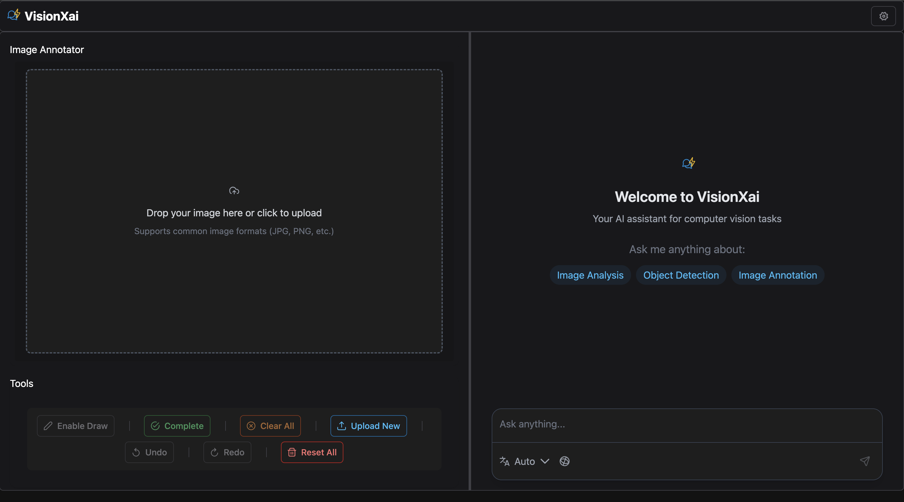

# VisionXAI

VisionXAI is a comprehensive project that integrates machine learning models with a web-based frontend and backend services. This project is designed to provide a seamless experience for deploying and interacting with AI models.

## Project Structure

- **LLM/**: Contains the logic for the language model, including scripts and Jupyter notebooks for testing.
- **Frontend/**: Houses the web application built with modern web technologies. It includes configuration files for TypeScript, Tailwind CSS, and Vercel deployment.
- **Backend/**: Contains the server-side logic, including API services, model configurations, and memory management.

## Getting Started

### Prerequisites

- Node.js and npm for the frontend
- Python 3.x for the backend
- Vercel CLI for deployment

### Installation

1. **Clone the repository**:

   ```bash
   git clone https://github.com/yourusername/VisionXAI.git
   cd VisionXAI
   ```

2. **Install Frontend Dependencies**:

   ```bash
   cd Frontend
   npm install
   ```

3. **Install Backend Dependencies**:
   ```bash
   cd ../Backend
   pip install -r requirements.txt
   ```

### Running the Project

- **Frontend**: Navigate to the `Frontend` directory and run:

  ```bash
  npm start
  ```

- **Backend**: Navigate to the `Backend` directory and run:
  ```bash
  python app/main.py
  ```

### Testing

- **Frontend**: Use Jest for running tests.

  ```bash
  npm test
  ```

- **Backend**: Use the provided Jupyter notebooks in the `LLM` directory for testing models.

## ImageChatBot Functionality

The `ImageChatBot` class, located in `Backend/app/memory.py`, is an intelligent chatbot designed to analyze images and answer questions based on their content. It can optionally use external search results to provide more contextually accurate responses.

### Key Features

- **Image Analysis**: Utilizes the `ChatGoogleGenerativeAI` model to understand and describe visual elements within an image.
- **Search Integration**: Employs the `TavilySearchResults` tool to fetch additional context from the web, enhancing the chatbot's ability to answer questions accurately.
- **Conditional Search**: Determines whether a search is necessary based on the user's query and the image content.
- **Response Formatting**: Provides responses in markdown format, including citations for any external sources used.

### Usage Example

The chatbot can encode images to base64, decide if a search is needed, and generate responses with or without search results. It supports both synchronous and asynchronous response streaming.


